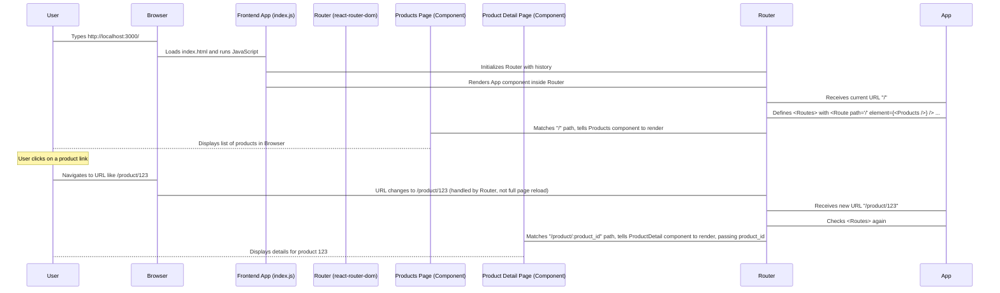

# Chapter 1: Frontend Application (React)

Welcome to the first chapter of the `Recommender-Algorithm` tutorial! We're starting at the part you'll see and interact with directly: the **Frontend Application**.

Think about visiting an online store. What do you see? You see lists of products, maybe a search bar, buttons to add items to a basket, a page for your account, and so on. All of this is the *frontend*. It's the user interface – the part of the application that runs in your web browser.

In our `Recommender-Algorithm` project, the frontend is built using a popular tool called **React**. React is a JavaScript library that helps us build these user interfaces in a structured way.

## What Problem Does the Frontend Solve?

The main problem the frontend solves is presenting information to the user and allowing them to interact with it. Imagine we have a list of products stored somewhere (this "somewhere" is usually called the backend, which we'll talk about later!). How does the user see these products? How do they click on one to see details? How do they add it to their basket?

The frontend handles all of this. It gets the product information, displays it nicely, listens for clicks and other user actions, and shows the user feedback.

A central use case is simply **browsing products**. A user visits our application and sees a list of items. They should be able to scroll through the list, click on an item they like, and be taken to a page with more details about that specific product. The frontend is responsible for both showing the initial list and managing the switch to the detail page when an item is clicked.

## Key Concepts

Let's break down some key ideas about our React frontend:

1.  **Components:** Think of components as building blocks. A button is a component, a list of products is a component, even a whole page is often built from many smaller components nested inside each other. React helps us create these reusable pieces.
2.  **Pages:** Our application has different "pages" like the product list, a single product's detail page, a basket page, and login/signup pages.
3.  **Routing:** How do we move between these pages? Routing is the mechanism that looks at the web address (the URL) and decides which page component to show. For example, when you go to `/basket`, the router shows the Basket component.
4.  **User Interaction:** The frontend captures everything the user does – clicking buttons, typing in forms, scrolling. It reacts to these actions.
5.  **Displaying Information:** It takes data (like product names, prices, descriptions) and displays it in a user-friendly way.

## How to Run the Frontend

Before we look at the code, let's see how you would typically start and run this frontend application on your computer.

You can use npm scripts. The most common one for development is `npm start`.

```bash
npm start
```

When you run this command from the `frontend` directory in your project terminal, here's what happens:

*   The React development server starts up.
*   It compiles your React code.
*   It usually automatically opens your default web browser to the address `http://localhost:3000`.

This is where you'll see the application come to life! You can then interact with it directly in your browser. Any changes you make to the code while it's running will often cause the page to automatically refresh, showing you the updates instantly.

## Looking at the Code Structure

Let's peek into the code files (`frontend/src/App.js` and `frontend/src/index.js`) to see how these concepts are put together, specifically focusing on how pages and routing work.

First, `frontend/src/index.js` is the main entry point for our React application. It's like the main door where everything starts.

```javascript
// frontend/src/index.js (Simplified)
import React from "react";
import ReactDOM from "react-dom/client";
import "./index.css";
import App from "./App";
import { BrowserRouter } from "react-router-dom";
// ... other imports like ChakraProvider, QueryClientProvider, AuthProvider, BasketProvider

const root = ReactDOM.createRoot(document.getElementById("root"));

root.render(
  <BrowserRouter> {/* Allows routing using browser history */}
    {/* ... other Provider components for styling, data fetching, authentication, basket */}
    <App /> {/* The main application component */}
  </BrowserRouter>
);
```

In this simplified `index.js`, we see that the main `<App />` component is wrapped inside `<BrowserRouter>`. This component, provided by the `react-router-dom` library, is essential for enabling routing within our application using standard web URLs. The other components like `ChakraProvider`, `QueryClientProvider`, `AuthProvider`, and `BasketProvider` wrap the app to provide shared functionality and data throughout the application, which we will cover in later chapters like [User Authentication Context](03_user_authentication_context_.md) and [Frontend API Client](02_frontend_api_client_.md).

Next, let's look at `frontend/src/App.js`. This file is where we define the main structure of our application, especially *which* component should be displayed for *which* web address (URL).

```javascript
// frontend/src/App.js (Simplified)
import React from "react";
import { Routes, Route } from "react-router-dom";
// ... other imports like Navbar, Products, ProductDetail, Signin, etc.

function App() {
  return (
    <> {/* A special React tag that lets us return multiple elements */}
      {/* <Navbar /> is shown on all pages */}
      {/* <Box height="80px" /> is just space */}
      <div id="content">
        <Routes> {/* This is where routing magic happens */}
          <Route path="/" element={<Products />} /> {/* Show <Products /> component when URL is "/" */}
          <Route path="/product/:product_id" element={<ProductDetail />} /> {/* Show <ProductDetail /> when URL is like "/product/123" */}
          {/* ... other routes for /signin, /signup, /basket, /admin, etc. */}
          <Route path="*" element={<Error404 />} /> {/* Show <Error404 /> for any other URL */}
        </Routes>
      </div>
    </>
  );
}

export default App;
```

Here, the `<Routes>` component acts like a container for all our possible paths (URLs). Each `<Route>` component defines a specific path (`path="/"`, `path="/product/:product_id"`, etc.) and specifies which React component (`element={<Products />}`, `element={<ProductDetail />}`, etc.) should be rendered when the browser's URL matches that path.

Notice the `/product/:product_id` path. The `:product_id` part is a placeholder. It tells React Router that this part of the URL can be anything (like a product's unique ID number), and it will make that value available to the `ProductDetail` component so it knows which product to display.

## Internal Implementation Walkthrough (Navigation)

Let's trace what happens when a user navigates, using our use case: starting at the product list and clicking on a product.



1.  The user opens the app, and `index.js` sets up the basic environment, including the router (`BrowserRouter`).
2.  The `App.js` component uses `<Routes>` and `<Route>` to define which component corresponds to which URL.
3.  When the browser's URL is `/`, the router matches the `path="/" Route` and renders the `<Products />` component.
4.  When the user clicks a link to view a product (let's say product ID 123), the frontend (specifically, the link inside the Products component, often using React Router's `<Link>` component) changes the browser's URL to something like `/product/123`.
5.  Because we are using `react-router-dom`, this URL change doesn't cause a full page refresh. Instead, the router detects the change.
6.  The router looks at the new URL (`/product/123`) and finds the matching `path="/product/:product_id" Route` in `App.js`.
7.  It then renders the `<ProductDetail />` component, passing the value `123` (the `product_id`) to it. The `ProductDetail` component can then use this ID to know which product's details to fetch and display.

This whole process happens very quickly, giving the user a smooth experience as they navigate between different parts of the application without waiting for the browser to load a completely new page each time.

## Code Deep Dive (Simplified)

Let's revisit the code snippets with a slightly deeper look.

In `index.js`, the `root.render` part is where React officially starts rendering our application into the part of the HTML page with the ID `root`.

```javascript
// frontend/src/index.js (Snippet)
const root = ReactDOM.createRoot(document.getElementById("root")); // Find the main div in index.html

root.render( // Start rendering here
  <QueryClientProvider client={queryClient}> {/* For fetching data */}
    <BrowserRouter> {/* Handles browser history for routing */}
      <ChakraProvider> {/* Provides styling components */}
        <AuthProvider> {/* Provides authentication state/functions */}
          <BasketProvider> {/* Provides basket state/functions */}
            <App /> {/* Our main app structure */}
          </BasketProvider>
        </AuthProvider>
      </ChakraProvider>
    </BrowserRouter>
  </QueryClientProvider>
);
```

You can see the `<App />` component nested inside several other components like `<BrowserRouter>`, `<ChakraProvider>`, `<AuthProvider>`, and `<BasketProvider>`. These are "Provider" components. They use a React feature called Context to make certain data or functionalities available to *any* component inside them, no matter how deeply nested.

*   `<BrowserRouter>` provides the routing capabilities.
*   `<ChakraProvider>` provides styling tools (Chakra UI is a component library).
*   `<AuthProvider>` will provide user authentication status and functions (covered in [User Authentication Context](03_user_authentication_context_.md)).
*   `<BasketProvider>` will provide the user's basket state (items added) and functions to manage it.
*   `<QueryClientProvider>` is for managing data fetching from our backend API (covered conceptually before [Frontend API Client](02_frontend_api_client_.md)).

In `App.js`, the core routing logic is concise:

```javascript
// frontend/src/App.js (Snippet)
function App() {
  return (
    <>
      {/* ... Navbar and Spacer */}
      <div id="content">
        <Routes>
          <Route path="/" element={<Products />} />
          <Route path="/product/:product_id" element={<ProductDetail />} />
          <Route path="/signin" element={<Signin />} />
          {/* ... other routes */}
          <Route path="*" element={<Error404 />} />
        </Routes>
      </div>
    </>
  );
}
```

This clearly maps paths to components. When the user is at `/`, the `Products` component is rendered inside the `div id="content"`. If they navigate to `/signin`, the `Signin` component is rendered there instead. The `<Navbar />` and the `<Box height="80px" />` (which likely acts as a spacer so content doesn't hide under a fixed navbar) are outside the `<Routes>`, meaning they appear on *every* page.

## Analogy Time!

Imagine our frontend application is a physical store:

*   **The store building itself:** This is like the overall browser window and the `index.html` file.
*   **The different sections inside (e.g., Electronics aisle, Clothing section, Checkout counter):** These are our different **Pages** or main components like `Products`, `ProductDetail`, `Basket`, `Signin`.
*   **The signs guiding you ("Electronics", "Checkout"):** This is like the **Routing**. It helps the application know which "section" to show based on where the user wants to go (the URL).
*   **The shelves, displays, and product tags:** These are the smaller **Components** that make up each section, displaying information.
*   **You, the customer, picking up an item, putting it in your cart, going to checkout:** This is the **User Interaction**. The frontend listens to what you do.
*   **The staff who put price tags on items, arrange shelves, or take your payment:** This is like the frontend **displaying information** fetched from somewhere else (the backend warehouse!).

Our React frontend is like a well-organized store that makes it easy for customers (users) to find what they need and move around efficiently.

## Conclusion

In this first chapter, we've introduced the **Frontend Application** as the user-facing part of our project, built using React. We learned that it uses components as building blocks, manages different pages, and uses routing (`react-router-dom`) to navigate between them based on the URL. We saw how to start the application using `npm start` and looked at simplified versions of the `index.js` and `App.js` files to understand the basic setup and routing structure.

The frontend is what the user sees, but it often needs to talk to the "behind-the-scenes" part of the application – the backend – to get data (like product lists) or send data (like placing an order).

In the next chapter, we'll explore how the frontend communicates with the backend by looking at the **Frontend API Client**.

[Next Chapter: Frontend API Client](02_frontend_api_client_.md)

---
