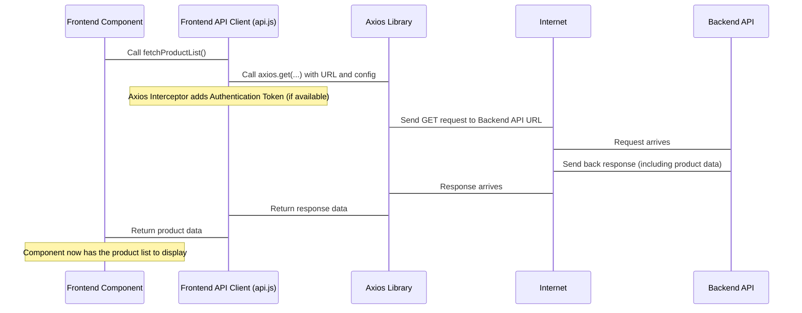

# Chapter 2: Frontend API Client

Welcome back! In [Chapter 1: Frontend Application (React)](01_frontend_application__react__.md), we explored the part of our project that you see and interact with – the user interface built with React. We saw how the frontend displays information and handles navigation between different pages.

But the frontend doesn't have all the information itself. Where does the list of products come from? How does it know if a user is logged in? How does it send an order? This information and the actions we take (like logging in or placing an order) usually live on the **backend**, the server-side part of the application.

So, the frontend needs a way to talk to the backend. That's where the **Frontend API Client** comes in.

## What Problem Does the Frontend API Client Solve?

Imagine the frontend is a customer in a store, and the backend is the warehouse and the cash register. The customer needs to ask the warehouse for items or tell the cash register they want to buy something. They can't just walk into the warehouse or behind the counter themselves. They need a way to communicate their requests and receive the results.

The problem the Frontend API Client solves is being the **dedicated communication channel** between the frontend (the browser) and the backend (the server). It's like the store's internal messaging system or a dedicated assistant who handles all requests to the warehouse and cash register.

A central use case where this is essential is **fetching data to display**. For example, when the user lands on the product list page (`/`), the frontend needs to *get* the list of available products from the backend. The API client is the part that handles *making the request* for this product list.

## Key Concepts

Let's break down the key ideas behind the Frontend API Client:

1.  **What is an API?** API stands for Application Programming Interface. Think of it as a set of rules or commands that the backend understands. The frontend sends requests following these rules (e.g., "Give me the list of products", "Here's the user's login details"). The backend then responds according to the same rules (e.g., "Here's the list of products you asked for", "Login successful").
2.  **Why use a library like Axios?** Sending requests from JavaScript in a browser can be done with built-in tools, but libraries like Axios make it much easier. Axios handles things like automatically converting data to JSON (a common format for sending data), handling errors, and adding extra information to requests. It simplifies the process greatly.
3.  **The API Client Module:** Instead of scattering code for talking to the backend throughout all our frontend components, we create one specific place (a module or file) for all these communication functions. This module is our "API Client". It keeps our code organized and makes it easier to manage all backend interactions.
4.  **Types of Requests:**
    *   **GET:** Used to *get* data from the backend (like fetching a product list or details for a single product).
    *   **POST:** Used to *send* data to the backend to create something new (like creating a new user account or placing an order).
    *   **PUT / PATCH:** Used to *update* existing data.
    *   **DELETE:** Used to *delete* data.
    Our API client will contain functions for these different actions.
5.  **Authentication Tokens:** When a user logs in, the backend often sends back a special code called an authentication token. For subsequent requests that require the user to be logged in (like placing an order or viewing their profile), the API client needs to include this token with the request so the backend knows who is making the request and that they are allowed to do so.

## Solving the Use Case: Fetching Products

Let's see how our API client handles fetching the list of products, building on our use case from Chapter 1.

We'll have a function in our API client module specifically for this task. Looking at the provided `frontend/src/api.js` file, we see a function called `fetchProductList`:

```javascript
// frontend/src/api.js (Snippet)
import axios from "axios"; // Import the Axios library

// ... (Axios interceptor and other functions) ...

export const fetchProductList = async ({ pageParam = 1 }) => {
  // Use axios.get to send a GET request
  const { data } = await axios.get(
    `${process.env.REACT_APP_BASE_ENDPOINT}/product?page=${pageParam}` // The URL to request data from
  );

  return data; // Return the data received from the backend
};

// ... (other functions) ...
```

*   `import axios from "axios";` brings in the library we're using.
*   `export const fetchProductList = async ({ pageParam = 1 }) => { ... }` defines a function that can be used by other parts of the frontend. `async` means it performs an operation that might take some time (like talking over the internet) and `await` pauses the function until the `axios.get` request finishes.
*   `axios.get(...)` is the core of the request. It tells Axios to perform a GET request.
*   `${process.env.REACT_APP_BASE_ENDPOINT}/product?page=${pageParam}` is the *address* (URL) on the backend where we expect to find the product list. `process.env.REACT_APP_BASE_ENDPOINT` gets the base URL for our backend from environment settings, and `/product?page=${pageParam}` specifies the `/product` *endpoint* and includes a `page` parameter for pagination (getting products page by page).
*   `const { data } = await axios.get(...)` waits for the response. Axios puts the actual information sent back by the backend into a property called `data`. We extract this using `{ data }`.
*   `return data;` sends the received product list back to the part of the frontend that called this function.

A frontend component (like the one rendering the product list page) would then simply *call* this function when it needs the data:

```javascript
// Inside a React component that needs product data (Simplified example)
import { fetchProductList } from "../api"; // Import the function

// ... later in the component ...

const loadProducts = async () => {
  try {
    const products = await fetchProductList({ pageParam: 1 }); // Call the API client function
    console.log("Fetched products:", products); // Do something with the data (like update the component's state to display them)
  } catch (error) {
    console.error("Error fetching products:", error);
    // Handle the error (show an error message)
  }
};

// Call loadProducts when the component needs data (e.g., when it first appears)
// loadProducts();
```

This example shows how easy the API client makes it for the component. The component doesn't need to know *how* to make the HTTP request, *how* to add headers, or *how* to parse the response. It just calls `fetchProductList()` and gets the data back, or an error if something went wrong.

## Internal Implementation Walkthrough

Let's trace the path of that `fetchProductList` request conceptually:



1.  The Frontend Component needs the product list, so it calls the `fetchProductList` function defined in `frontend/src/api.js`.
2.  The `fetchProductList` function uses the imported `axios` library.
3.  Just before sending the request, Axios has a special feature called an "interceptor". We've configured an interceptor in `api.js` to automatically look for an authentication token saved in the browser's storage and add it to the request's headers if it exists. This is crucial for protected routes and simplifies token management (more on this in [Chapter 3: User Authentication Context](03_user_authentication_context_.md)).
4.  Axios sends the actual GET request over the internet to the Backend API URL.
5.  The Backend API receives the request, processes it (gets product data from the database), and sends back a response over the internet.
6.  Axios receives the response.
7.  The `await axios.get(...)` call in `fetchProductList` finishes, and Axios gives the response data back to the `fetchProductList` function.
8.  `fetchProductList` returns this data to the Frontend Component that originally called it.
9.  The Frontend Component receives the data and can now display the list of products to the user.

This flow shows how the API Client acts as a consistent layer between the frontend UI and the backend, handling the technical details of communication.

## Code Deep Dive (Simplified)

Let's look at `frontend/src/api.js` again, focusing on the structure and the interceptor.

```javascript
// frontend/src/api.js (Simplified)
import axios from "axios";

// This code runs BEFORE every request sent by Axios
axios.interceptors.request.use(
  function (config) {
    // Check if the request is going to our backend URL
    const { origin } = new URL(config.url);
    const allowedOrigins = [process.env.REACT_APP_BASE_ENDPOINT];

    // Get the stored token (explained more in Chapter 3)
    const token = localStorage.getItem("access-token");

    // If it's our backend AND we have a token, add it to the headers
    if (allowedOrigins.includes(origin) && token) {
      config.headers.authorization = token; // Add "Bearer <token>" format is common
    }
    return config; // Continue with the request
  },
  function (error) {
    // Handle request errors (e.g., network issues before sending)
    return Promise.reject(error);
  }
);

// --- Functions for specific backend calls ---

export const fetchProductList = async ({ pageParam = 1 }) => {
  // Calls the backend GET /product endpoint
  const { data } = await axios.get(`${process.env.REACT_APP_BASE_ENDPOINT}/product?page=${pageParam}`);
  return data;
};

export const fetchLogin = async (input) => {
    // Calls the backend POST /auth/login endpoint
    const { data } = await axios.post(`${process.env.REACT_APP_BASE_ENDPOINT}/auth/login`, input);
    return data; // This data might include tokens!
};

export const fetchMe = async () => {
    // Calls the backend GET /auth/me endpoint - requires token added by interceptor!
    const { data } = await axios.get(`${process.env.REACT_APP_BASE_ENDPOINT}/auth/me`);
    return data;
};

// ... many other functions for other backend interactions (postProduct, fetchOrders, etc.)
```

*   **Interceptor:** The `axios.interceptors.request.use(...)` block is the "mailroom assistant". Before *any* request leaves the API client using Axios, this function runs. It checks the destination (`config.url`). If the destination is our backend (`allowedOrigins`), it grabs the `access-token` from `localStorage` (where we store it after login - explained in [Chapter 3: User Authentication Context](03_user_authentication_context_.md)) and adds it to the request's `headers`. This way, every function in `api.js` that needs authentication automatically gets the token added without needing repetitive code in each function.
*   **Specific Functions:** Below the interceptor, you see separate `export const` functions for different backend actions (`fetchProductList`, `fetchLogin`, `fetchMe`, etc.). Each function is responsible for talking to a *specific* backend *endpoint* using the appropriate HTTP method (`axios.get`, `axios.post`, etc.). This makes our API client easy to use and understand – if you need to log in, you call `fetchLogin`; if you need your user info, you call `fetchMe`.

This structure keeps the concerns separate: the interceptor handles the *cross-cutting* concern of adding the token, while individual functions handle the *specific* concern of calling a particular backend endpoint.

## Analogy Time! (Revisited)

Let's add the API Client to our store analogy from Chapter 1:

*   **The store building (Frontend):** The UI the user sees.
*   **Different sections (Pages):** `Products` aisle, `Checkout` counter, `Login` desk.
*   **Signs (Routing):** How you navigate between sections.
*   **Shelves/Displays (Components):** Displaying items.
*   **You (User):** Interacting.
*   **Staff arranging shelves (Frontend rendering):** Displaying data.
*   **The Warehouse & Cash Register (Backend):** Where products are stored, where transactions happen.
*   **The **Frontend API Client** (api.js):** The **Communication Office** within the store.
    *   Need products on the shelves? The `fetchProductList` assistant in the Communication Office sends a request to the Warehouse.
    *   Customer wants to checkout? The `postOrder` assistant sends the order details to the Cash Register.
    *   Customer logs in? The `fetchLogin` assistant sends credentials to the Authentication Department in the Backend.
    *   The **Axios Library** is like the **reliable messenger service** the Communication Office uses to send and receive messages quickly and formatted correctly.
    *   The **Interceptor** is like the **rule** that the Communication Office always follows: "If a message is going to *our* Warehouse/Cash Register/Auth Dept, always attach the customer's VIP card details (the token) if they have one."

The API client is the organized system that ensures all necessary communication with the backend happens smoothly and correctly, centralizing the logic and making it reusable.

## Conclusion

In this chapter, we introduced the **Frontend API Client** as the crucial link between our React frontend and the backend. We learned that it centralizes all backend communication using libraries like Axios, handling different types of requests (GET, POST, etc.) to specific backend API endpoints. We saw how a function like `fetchProductList` simplifies getting data for frontend components and how the Axios interceptor helps automatically manage authentication tokens.

The API client is the messenger, but how does the frontend *know* which token to use or *who* the current user is after logging in? That state needs to be managed and accessible throughout the application.

In the next chapter, we'll dive into the **User Authentication Context**, which shows how we manage the logged-in user's information and tokens on the frontend, making them available to the API client and any component that needs to know if the user is authenticated.

[Next Chapter: User Authentication Context](03_user_authentication_context_.md)

---
