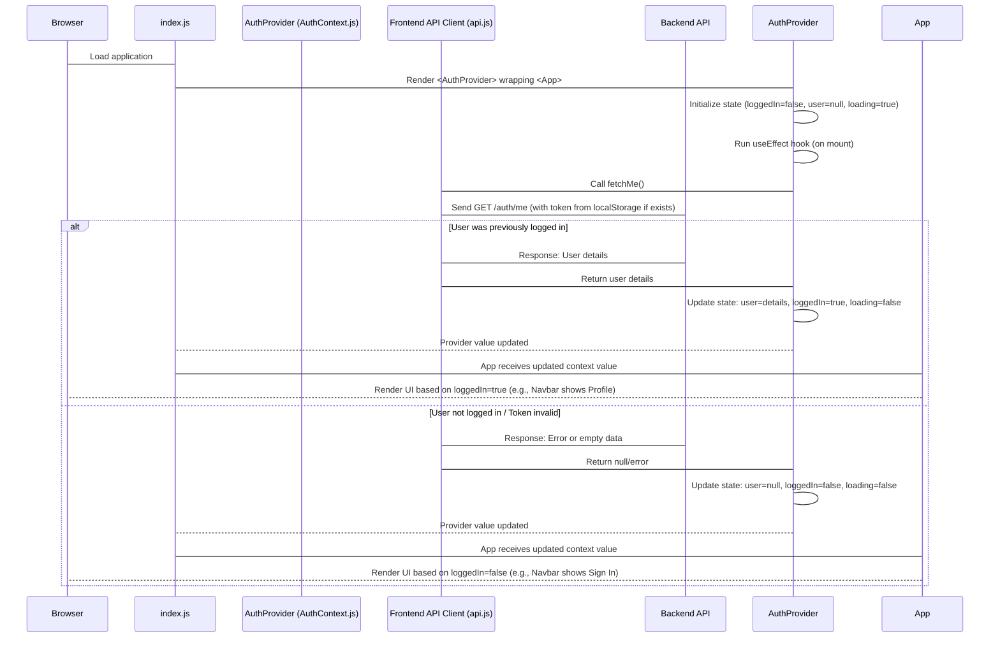
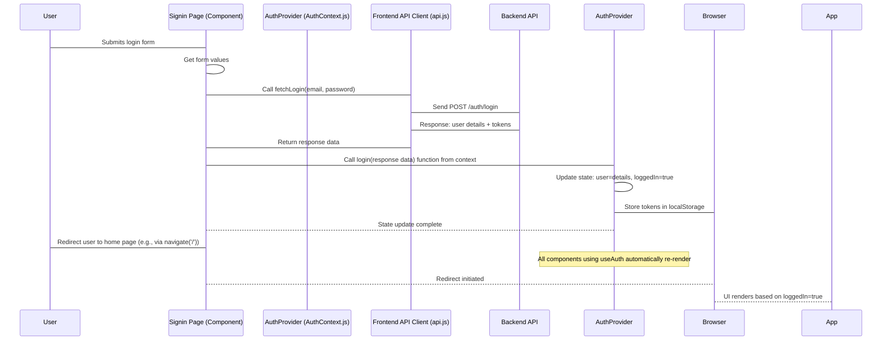

# Chapter 3: User Authentication Context

Welcome back! In the previous chapter, [Chapter 2: Frontend API Client](02_frontend_api_client_.md), we learned how our frontend application talks to the backend using a dedicated API client, making requests to fetch or send data. We also touched upon the idea of authentication tokens being needed for certain requests.

Now, imagine a user logs in. We get a token back from the backend. We need to remember that the user is logged in, who they are (their user details), and keep that token handy for future requests that require authentication. How do we make this information easily available to *any* part of our frontend application that might need it – like the navigation bar (to show "Profile" instead of "Sign In"), a product page (to allow adding to a basket only if logged in), or a profile page (to show user details)?

Simply passing the user data down through every single component ("prop drilling") would be incredibly tedious and make our code messy, especially in a larger application.

## What Problem Does User Authentication Context Solve?

The **User Authentication Context** solves the problem of managing the user's login status and information and making it easily accessible throughout the frontend application *without* explicitly passing it through every component like a game of "pass the parcel."

It acts as a central source of truth for everything related to the currently logged-in user.

A central use case for this is **controlling the user interface based on login status**. For example, in the `Navbar` ([`frontend/src/components/Navbar/index.js`](frontend/src/components/Navbar/index.js)), we want to display "Sign In" and "Sign Up" buttons if no user is logged in, but switch to showing the user's avatar, a "Profile" link, and a "Logout" button if a user *is* logged in.

## Key Concepts

To understand the User Authentication Context, let's look at the core ideas behind it, mainly using React's built-in **Context API**:

1.  **Context API:** This is a feature in React designed to share data that can be considered "global" for a tree of components. Think of it like a radio station broadcasting information that any component can "tune into" if it needs to hear it. It avoids the need to pass data down level by level through props.
2.  **Context:** This is the "channel" itself. We create a specific context for authentication data.
3.  **Provider:** This is the component that broadcasts the data onto the context channel. It holds the actual state (like `loggedIn`, `user`, `token`) and provides functions to update that state (like `login`, `logout`). All components that need access to the authentication data must be wrapped *inside* this Provider component.
4.  **Consumer (or `useContext` Hook):** This is how a component "tunes into" the context channel to read the data or use the functions provided by the Provider. In modern React, we use the `useContext` hook for this, which is much cleaner than the older Consumer component.
5.  **Authentication State:** This is the actual data being managed by the context:
    *   `loggedIn`: A simple boolean (true/false) indicating if a user is currently authenticated.
    *   `user`: An object containing the details of the logged-in user (like `email`, `role`, etc.).
    *   `loading`: A boolean indicating if the context is currently in the process of checking the login status (especially when the app first starts).
6.  **Authentication Actions:** Functions provided by the context to change the state:
    *   `login(data)`: Updates the state to reflect that a user is logged in, stores user details and tokens.
    *   `logout()`: Updates the state to reflect that the user is logged out, removes tokens.

## Solving the Use Case: Displaying Navbar Links

Let's see how the `Navbar` uses the authentication context to display the correct links based on the user's login status.

First, we wrap our entire application (or at least the part that needs authentication info) inside the `AuthProvider` component in `index.js`. We saw this in [Chapter 1: Frontend Application (React)](01_frontend_application__react__.md).

```javascript
// frontend/src/index.js (Simplified)
import React from "react";
import ReactDOM from "react-dom/client";
// ... other imports
import { AuthProvider } from "./contexts/AuthContext"; // Import the Provider

const root = ReactDOM.createRoot(document.getElementById("root"));

root.render(
  // ... other Providers like BrowserRouter, ChakraProvider, QueryClientProvider
  <AuthProvider> {/* Wrap the App inside AuthProvider */}
    <App />
  </AuthProvider>
  // ...
);
```

Now, any component *inside* `<AuthProvider>` (which includes our `<App />` and everything it renders, like `<Navbar />`) can access the authentication context.

Inside the `Navbar` component ([`frontend/src/components/Navbar/index.js`](frontend/src/components/Navbar/index.js)), we "tune into" the context using the `useAuth` hook:

```javascript
// frontend/src/components/Navbar/index.js (Snippet)
import { useAuth } from "../../contexts/AuthContext"; // Import the custom hook

function Navbar() {
  const { user, loggedIn, logout } = useAuth(); // Get the user and loggedIn state, and logout function

  // ... rest of the component logic ...

  return (
    <Box>
      {/* ... other Navbar elements */}
      <HStack spacing={4}>
        {/* Conditionally render links based on loggedIn and user.role */}
        {loggedIn && user?.role === "admin" && (
          <NavLink to="/admin">Admin</NavLink>
        )}
        {loggedIn && ( // Show Basket if logged in
          <NavLink to="/basket">Basket</NavLink>
        )}

        {!loggedIn ? ( // If NOT logged in, show Sign In/Sign Up
          <>
            <Button as={RouterLink} to="/signin">Sign In</Button>
            <Button as={RouterLink} to="/signup">Sign Up</Button>
          </>
        ) : ( // If logged in, show user avatar and menu
          <Menu>
            <MenuButton as={Button}>
              <Avatar size="sm" name={user.name} /> {/* Show avatar */}
            </MenuButton>
            <MenuList>
              <MenuItem as={RouterLink} to="/profile">Profile</MenuItem> {/* Profile link */}
              <MenuItem onClick={logout}>Logout</MenuItem> {/* Logout button */}
            </MenuList>
          </Menu>
        )}
        {/* ... color mode toggle and mobile menu button */}
      </HStack>
      {/* ... Mobile navigation */}
    </Box>
  );
}
```

This snippet shows the core idea: by calling `const { user, loggedIn, logout } = useAuth();`, the `Navbar` component gets direct access to the `loggedIn` boolean, the `user` object, and the `logout` function *directly from the context*. It doesn't need to receive them as props from its parent components. It can then use these values (`loggedIn`, `user?.role`) in conditional rendering (`{!loggedIn ? (...) : (...) }`) to decide what to show. When the user clicks "Logout", the `logout` function from the context is called, which updates the context state, causing the `Navbar` (and any other component using `useAuth`) to automatically re-render and show the updated state (i.e., the "Sign In" buttons again).

## Internal Implementation Walkthrough

Let's trace what happens when the application first loads and then when a user logs in, focusing on the `AuthContext.js` file ([`frontend/src/contexts/AuthContext.js`](frontend/src/contexts/AuthContext.js)).

**App Loading:**



1.  When the app loads, `index.js` renders the `<AuthProvider>` component around the main `<App />`.
2.  The `AuthProvider` initializes its internal state (`loggedIn`, `user`, `loading`). `loading` is initially `true` because we need to check if the user is already logged in from a previous session.
3.  An `useEffect` hook inside `AuthProvider` runs when the component mounts. This hook checks if there's an authentication token saved in the browser's `localStorage` (remember this from the [Frontend API Client](02_frontend_api_client_.md)?).
4.  If a token exists, it uses the [Frontend API Client](02_frontend_api_client_.md)'s `fetchMe()` function to ask the backend for the user's details associated with that token. (The API client's interceptor automatically adds the token to the request).
5.  The backend responds with either the user's details (if the token is valid) or an error/empty response (if not).
6.  Based on the backend's response, the `AuthProvider` updates its internal state (`user`, `loggedIn`, `loading`).
7.  Since the context state has changed, all components using `useAuth` (like the `Navbar`) automatically re-render with the new state, displaying the appropriate UI. While `loading` is `true`, the `AuthProvider` renders a loading spinner (as seen in the code), providing a smooth user experience.

**User Logs In:**



1.  The user enters their email and password on the Signin page ([`frontend/src/pages/Auth/Signin/index.js`](frontend/src/pages/Auth/Signin/index.js)) and submits the form.
2.  The Signin component calls the `fetchLogin` function from the [Frontend API Client](02_frontend_api_client_.md).
3.  The API Client sends the login request to the backend.
4.  The backend authenticates the user and, if successful, sends back user details and tokens (access and refresh tokens).
5.  The Signin component receives this data.
6.  Crucially, the Signin component then calls the `login()` function provided by the `useAuth()` hook (which comes from the `AuthProvider`).
7.  The `login()` function inside `AuthProvider` updates the internal state (`user`, `loggedIn`). It also saves the received tokens (and maybe the user ID) into the browser's `localStorage` so the user can stay logged in even if they close and reopen the browser.
8.  Because the `AuthProvider`'s state changed, all components using `useAuth` automatically re-render, reflecting the new logged-in state (e.g., the `Navbar` switches to showing "Profile" and the avatar).
9.  The Signin component then redirects the user to another page (like the product list), and the UI on that page is correctly rendered for a logged-in user.

This shows how the context centralizes the state management and the functions to change that state, making it easy for different parts of the app (like the Signin page and the Navbar) to interact with the authentication status.

## Code Deep Dive (Simplified)

Let's look closer at [`frontend/src/contexts/AuthContext.js`](frontend/src/contexts/AuthContext.js).

First, creating the context and hook:

```javascript
// frontend/src/contexts/AuthContext.js (Snippet)
import { useState, createContext, useContext, useEffect } from "react";
import { fetchLogout, fetchMe, fetchRecommendations } from "../api"; // Need API calls
// ... other imports for loading spinner

const AuthContext = createContext(); // Create the context

// The component that provides the state
const AuthProvider = ({ children }) => {
  const [user, setUser] = useState(null); // State for user data
  const [loggedIn, setLoggedIn] = useState(false); // State for login status
  const [loading, setLoading] = useState(true); // State while checking initial status

  // ... useEffect for initial status check ...
  // ... login function ...
  // ... logout function ...

  const values = { // Bundle up state and functions to share
    loggedIn,
    user,
    login,
    logout,
  };

  // If loading, show a spinner instead of the app
  if (loading) {
    return ( /* Chakra UI Spinner component */ );
  }

  // Provide the values to all children components
  return <AuthContext.Provider value={values}>{children}</AuthContext.Provider>;
};

// Custom hook to easily access the context values
const useAuth = () => useContext(AuthContext);

export { AuthProvider, useAuth }; // Export them for use in App.js and components
```

*   `createContext()` creates the actual context object.
*   `AuthProvider` is a functional component that takes `children` as a prop. This is where the state (`user`, `loggedIn`, `loading`) is held using `useState`.
*   The `useEffect` hook (not shown in detail here but present in the actual file) is crucial for checking if the user is already logged in when the app starts by calling `fetchMe` via the API client.
*   The `values` object bundles the state (`loggedIn`, `user`) and the functions (`login`, `logout`) that we want to expose to components using this context.
*   `<AuthContext.Provider value={values}>` is the key part. It wraps the `children` (our `<App />`) and makes the `values` object available to any component within the `children` that uses `useAuth`.
*   The `useAuth` function is a simple wrapper around `useContext(AuthContext)`. This is a common pattern that makes it cleaner to use the context in other components (`const { user } = useAuth()` vs. `const { user } = useContext(AuthContext)`).

Now, let's look at the `login` and `logout` functions within `AuthProvider`:

```javascript
// frontend/src/contexts/AuthContext.js (Snippet inside AuthProvider)
const login = async (data) => {
  // Update context state
  setUser(data.user);
  setLoggedIn(true);

  // Store tokens and user ID in browser's local storage
  // These are needed by the API client interceptor and maybe other places
  localStorage.setItem("userId", data.user._id); // Storing user ID here for event tracking example later
  localStorage.setItem("access-token", data.accessToken);
  localStorage.setItem("refresh-token", data.refreshToken);

  // Optional: Fetch recommendations after login (specific to this project)
  try {
    const recommendations = await fetchRecommendations(data.user._id);
    localStorage.setItem("recommendations", JSON.stringify(recommendations));
  } catch (error) {
    console.error("Error fetching recommendations:", error);
  }

  console.log("User logged in:", data); // For debugging
};

const logout = async () => {
  // Call backend logout endpoint (optional, invalidates token server-side)
  await fetchLogout(); // Uses the API client

  // Remove tokens and user ID from local storage
  localStorage.removeItem("access-token");
  localStorage.removeItem("refresh-token");
  localStorage.removeItem("userId");
  localStorage.removeItem("recommendations"); // Also clear recommendations

  // Update context state
  setUser(null);
  setLoggedIn(false);

  console.log("User logged out"); // For debugging
};
```

*   The `login` function takes the response data from the successful backend login call (which includes `user`, `accessToken`, `refreshToken`).
*   It updates the component's state using `setUser` and `setLoggedIn`.
*   It saves the tokens and user ID in `localStorage`. `localStorage` is part of the browser and allows saving key-value pairs persistently (until cleared by the user or code). This is why the user can stay logged in even after closing and reopening the browser – the `useEffect` hook on app load finds these saved tokens.
*   The `logout` function removes the tokens from `localStorage` and resets the state to `null` and `false`. It also calls a backend endpoint (`fetchLogout`) to potentially invalidate the token on the server side for better security.

This structure means that any component needing to check if the user is logged in, access user details, or trigger a login/logout simply calls `useAuth()` and uses the returned state or functions. The complex logic of `localStorage` management and state updates is contained within the `AuthProvider`.

## Analogy Time! (Revisited)

Let's add the Authentication Context to our store analogy:

*   **The Store (Frontend):** The UI.
*   **Sections/Pages:** Different parts of the store.
*   **Signs (Routing):** Navigation.
*   **Shelves (Components):** Displaying things.
*   **You (User):** Interacting.
*   **Communication Office (Frontend API Client):** Talking to the Backend (Warehouse/Cash Register).
*   **The **Authentication Context** (AuthContext.js):** The **Central Customer Status Board**.
    *   **`AuthContext.Provider`:** The main computer system managing the board. It knows if a customer (user) is currently "checked in" (logged in), who they are (user details), and has their temporary shopping pass (tokens).
    *   **`useAuth` hook:** The small terminals placed around the store (in components like the `Navbar`, `ProductDetail`, `Profile`). Any employee (component) can quickly look at a terminal to see if the current customer is checked in (`loggedIn`), see their name (`user`), or initiate the checkout/departure process (`logout`).
    *   **`login` function:** When a customer checks in at the entrance, the staff update the Central Customer Status Board via a terminal.
    *   **`logout` function:** When a customer leaves, the staff update the board again.
    *   **`localStorage`:** Like a temporary note the staff keeps on hand with the shopping pass details, just in case the system needs a quick reminder when they turn it on in the morning.
    *   **`fetchMe` (in `useEffect`):** Like the morning routine where staff check if anyone was "checked in" overnight using the notes (`localStorage`) and verify with the main system (Backend) if their pass is still valid.

This system ensures that all employees (components) are always aware of the current customer's status without needing someone to physically walk around and tell each one individually.

## Conclusion

In this chapter, we introduced the **User Authentication Context** as a powerful way to manage the state of the currently logged-in user in our React frontend. We learned how React's Context API, used to create the `AuthProvider` and `useAuth` hook, solves the problem of "prop drilling" and makes authentication state (`loggedIn`, `user`) and actions (`login`, `logout`) easily accessible to any component that needs them. We saw how this is used in the `Navbar` to control the displayed links and how the `AuthProvider` handles initial status checks (`fetchMe`) and token management in `localStorage` after login/logout.

The frontend now knows who the user is (or isn't) and how to manage their session state. But for authentication to actually *work*, the backend needs to understand login requests, verify credentials, issue tokens, and protect sensitive routes.

In the next chapter, we will shift our focus to the backend and explore **API Routes**, the specific addresses (`/auth/login`, `/auth/me`, `/product`, etc.) that the frontend API client talks to, and how they are structured on the server side.

[Next Chapter: API Routes](04_api_routes_.md)

---
