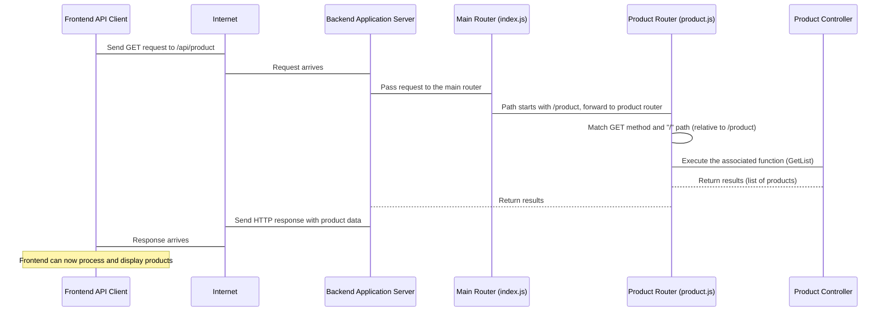

# Chapter 4: API Routes

Welcome back! In our journey so far, we've explored the frontend: [Chapter 1: Frontend Application (React)](01_frontend_application__react__.md) showed us the user interface, [Chapter 2: Frontend API Client](02_frontend_api_client_.md) explained how the frontend talks to the backend, and [Chapter 3: User Authentication Context](03_user_authentication_context_.md) covered managing the user's login state on the frontend.

We know the frontend *needs* to talk to the backend to get data (like products) or send data (like login details). But *how* does the frontend know *where* on the backend to send those requests? And *how* does the backend know which specific piece of code should handle a request asking for products versus a request trying to log a user in?

That's where **API Routes** come in.

## What Problem Do API Routes Solve?

Think of our backend application as a large building with many different departments: one for handling user accounts, one for managing products, one for processing orders, and so on. When the frontend (or any other client) wants to request a service, it needs to know which department to go to and exactly what kind of service it needs (e.g., "I want to *get* a list of products" vs. "I want to *create* a new order").

The problem **API Routes** solve is providing this **directory and mapping service** for the backend. They define the specific web addresses (URLs) and request types (like GET, POST) that clients can use, and they direct each incoming request to the correct piece of code (specifically, a "controller" function, which we'll cover later) that knows how to handle it.

A central use case demonstrating this is **accessing different types of resources**. The frontend needs one address to get product information, a different address to log in, and another address to view a specific order. API routes provide these distinct addresses and ensure that a request to `/product` gets handled by the product logic, while a request to `/auth/login` gets handled by the authentication logic.

## Key Concepts

Let's break down the core ideas behind API Routes:

1.  **URL/Path:** This is the web address part after the base address (like `/product` or `/auth/login`). It tells the backend *what type* of resource or service is being requested.
2.  **HTTP Method:** This is the *type* of action the client wants to perform on the resource. Common methods include:
    *   `GET`: Request data (like fetching a product list).
    *   `POST`: Send data to create something new (like creating a user or an order).
    *   `PUT` / `PATCH`: Send data to update something existing.
    *   `DELETE`: Request to remove something.
    The same path can behave differently depending on the method (e.g., `GET /product` gets products, `POST /product` might create a new product if allowed).
3.  **Endpoint:** The combination of a URL path and an HTTP method (e.g., `GET /product`, `POST /auth/login`). This is what the frontend's [Frontend API Client](02_frontend_api_client_.md) targets.
4.  **Router:** This is the backend code that acts like a traffic cop. It looks at the incoming request's URL path and HTTP method and decides which specific function should execute to handle that request. Our project uses the Express.js framework for the backend, which has a robust routing system.
5.  **Route Definition:** This is the specific line of code that tells the router: "If you see a request with THIS method going to THIS path, run THIS function."

## Solving the Use Case: Accessing Different Resources

Let's see how API Routes make it possible for the frontend to access different types of information, building on our product fetching example from [Chapter 2: Frontend API Client](02_frontend_api_client_.md).

The frontend needs to get a list of products. In [Chapter 2](02_frontend_api_client_.md), we saw the API client makes a `GET` request to the URL `${process.env.REACT_APP_BASE_ENDPOINT}/product`. Let's assume `REACT_APP_BASE_ENDPOINT` is `http://localhost:5000/api`. The frontend is sending a `GET` request to `http://localhost:5000/api/product`.

On the backend, API Routes are configured to listen for this exact request. Looking at the backend code ([`backend/dist/routes/index.js`](backend/dist/routes/index.js) and [`backend/dist/routes/product.js`](backend/dist/routes/product.js)), we find the route definitions that handle this.

The main router ([`backend/dist/routes/index.js`](backend/dist/routes/index.js)) acts as the primary entry point for all `/api/` requests. It directs requests to different *sub-routers* based on the first part of the path:

```javascript
// backend/dist/routes/index.js (Simplified)
// ... imports ...
const router = express.Router(); // Create a main router

// ... general routes like / or /test ...

// Direct requests starting with /auth to the authRouter
router.use("/auth", authRouter);

// Direct requests starting with /product to the productRouter
router.use("/product", productRouter);

// Direct requests starting with /order to the orderRouter (requires auth middleware)
router.use("/order", verifyAccessToken, orderRouter); // Note the middleware here

// Direct requests starting with /event to the eventRouter
router.use("/event", eventRoutes);

exports.default = router; // Export the main router
```

This snippet from `index.js` shows that any request hitting `/api/` (which is where this router is typically mounted in the main application file, as we'll see in [Chapter 5: Backend Application Server](05_backend_application_server_.md)) that starts with `/auth` is sent to `authRouter`, requests starting with `/product` go to `productRouter`, etc.

Our `GET /api/product` request first hits this main router, which sees `/product` and sends it to the `productRouter` defined in [`backend/dist/routes/product.js`](backend/dist/routes/product.js).

Now, let's look at the `productRouter`:

```javascript
// backend/dist/routes/product.js (Simplified)
import express from 'express';
const router = express.Router(); // Create a product-specific router

import ProductController from '../controllers/product';
// ... imports for middleware like verifyAccessToken, grantAccess ...

// Define routes specifically for the /product path (handled by this router)

// GET request to /product (this router's base path)
// Maps to ProductController.GetList function
router.get("/", ProductController.GetList);

// GET request to /product/:product_id (e.g., /product/123)
// Maps to ProductController.Get function
router.get("/:product_id", ProductController.Get);

// POST request to /product (requires authentication and admin grant)
// Maps to ProductController.Create function
router.post(
  "/",
  verifyAccessToken, // Middleware to check token
  grantAccess("createAny", "product"), // Middleware to check permissions
  ProductController.Create
);

// ... other routes for PUT, DELETE, SEARCH, etc. ...

export default router; // Export the product router
```

This `productRouter` now handles everything *under* the `/product` path. When our `GET /api/product` request arrives, this router finds the line `router.get("/", ProductController.GetList);`.

*   `router.get`: Specifies this route handles `GET` requests.
*   `"/"`: Specifies the path *relative to this router's base path* (`/product` in the main router). So, this matches `/product`.
*   `ProductController.GetList`: This is the specific function (in the product "department" or "controller") that will execute to fetch the list of products from the database and send them back as a response. We'll dive into controllers in [Chapter 8: Controllers](08_controllers_.md).

Similarly, a `POST` request from the frontend to `/api/auth/login` would first go through the main router (`index.js`), be directed to the `authRouter` ([`backend/dist/routes/auth.js`](backend/dist/routes/auth.js)), and then find the definition `router.post('/login', AuthController.Login);`, which maps it to the `AuthController.Login` function.

This system ensures that every specific request from the frontend lands exactly at the backend function designed to handle it.

## Internal Implementation Walkthrough

Let's trace the `GET /api/product` request from the network to the backend code using a simple sequence:



1.  The [Frontend API Client](02_frontend_api_client_.md) initiates a `GET` request to `/api/product`.
2.  The request travels over the internet and arrives at the Backend Application Server.
3.  The server receives the request and passes it to the top-level **Main Router** (`index.js`).
4.  The Main Router inspects the path (`/product`) and sees that requests starting with `/product` should be handled by the **Product Router** (`product.js`). It forwards the request to the Product Router.
5.  The Product Router inspects the method (`GET`) and the remaining path (`/`, relative to `/product`). It finds the matching route definition (`router.get("/", ...)`) and identifies the corresponding function in the **Product Controller** (`ProductController.GetList`).
6.  The Product Router executes the `ProductController.GetList` function.
7.  The Controller performs its logic (like fetching products from a database - covered in [Chapter 8: Controllers](08_controllers_.md) and [Chapter 6: Database Models](06_database_models_.md)) and returns the list of products.
8.  The Product Router sends these results back up to the Main Router, which sends them back to the Backend Application Server.
9.  The Backend Server formats the results into an HTTP response and sends it back over the internet to the waiting [Frontend API Client](02_frontend_api_client_.md).
10. The [Frontend API Client](02_frontend_api_client_.md) receives the response, and the Frontend Component (like the Product List page) can use the data to update the UI.

This illustrates how the routing system directs the request step-by-step to the exact piece of code responsible for handling it.

## Code Deep Dive (Simplified)

Let's look at a few more simplified snippets from the backend `dist/routes` directory to see how different route definitions look. Remember, these files are the compiled JavaScript output (`dist`) from the original source files (likely in a `src/routes` directory), but the structure of route definitions is the same.

**Authentication Routes (`backend/dist/routes/auth.js`)**

```javascript
// backend/dist/routes/auth.js (Simplified)
import express from 'express';
const router = express.Router();

import AuthController from '../controllers/auth'; // The controller for auth logic
import { verifyAccessToken } from '../helpers/jwt'; // Middleware

router.post('/register', AuthController.Register); // POST to /auth/register -> Register function
router.post('/login', AuthController.Login);       // POST to /auth/login    -> Login function
router.post('/refresh_token', AuthController.RefreshToken); // POST to /auth/refresh_token
router.post('/logout', AuthController.Logout);     // POST to /auth/logout   -> Logout function
router.get('/me', verifyAccessToken, AuthController.Me); // GET to /auth/me -> Check token FIRST, then Me function

export default router;
```

This shows how the `/auth` router defines specific endpoints for authentication actions. Notice the `router.get('/me', verifyAccessToken, AuthController.Me);` line. This includes `verifyAccessToken` *before* `AuthController.Me`. This means that any request to `GET /auth/me` must first pass through the `verifyAccessToken` middleware (a function that checks if the request has a valid token). Only if the token is valid does it proceed to the `AuthController.Me` function. This is how routes can be protected! Authentication and authorization ([Chapter 7](07_authentication___authorization_.md)) often rely on middleware attached directly to route definitions.

**Order Routes (`backend/dist/routes/order.js`)**

```javascript
// backend/dist/routes/order.js (Simplified)
import express from 'express';
const router = express.Router();

import OrderController from '../controllers/order'; // The controller for order logic

router.post('/', OrderController.Create);       // POST to /order       -> Create function
router.get('/', OrderController.List);         // GET to /order        -> List function
router.get('/my-orders', OrderController.GetMyOrders); // GET to /order/my-orders -> GetMyOrders function

export default router;
```

Here, the `/order` router defines routes for creating and listing orders. The main router (`index.js`) snippet we saw earlier shows that the entire `/order` router is protected by the `verifyAccessToken` middleware: `router.use("/order", verifyAccessToken, orderRouter);`. This means *all* routes defined within `order.js` automatically require a valid access token, making it simple to protect an entire section of the API.

**Event Routes (`backend/dist/routes/event.js`)**

```javascript
// backend/dist/routes/event.js (Simplified - uses require syntax)
const express = require("express");
const router = express.Router();
const { trackEvent, removeEvent, getEvents } = require("../controllers/event"); // Controller functions

router.post("/", trackEvent);  // POST to /event -> trackEvent function
router.delete("/", removeEvent); // DELETE to /event -> removeEvent function
router.get("/", getEvents);    // GET to /event -> getEvents function

module.exports = router;
```

This `event` router shows another example of mapping different methods (`POST`, `DELETE`, `GET`) on the *same* path (`/`) to different controller functions, allowing different actions related to events via the `/event` endpoint.

These examples demonstrate the pattern: each route file defines a router that handles a specific area of the application (`auth`, `product`, `order`, `event`), and within that router, individual lines map HTTP methods and specific paths to the exact controller functions responsible for the backend logic.

## Analogy Time! (Revisited)

Let's refine our store analogy to include API Routes:

*   **The Store (Frontend):** The UI.
*   **Sections/Pages:** Different parts of the store.
*   **Signs (Routing):** Navigation within the store (frontend routing).
*   **Shelves (Components):** Displaying things.
*   **You (User):** Interacting.
*   **Communication Office (Frontend API Client):** Sending requests to the Backend HQ.
*   **The Backend HQ Building (Backend Application Server):** The place where all services are located.
*   **The **API Routes** (backend/dist/routes):** The **Switchboard and Directory** of the Backend HQ.
    *   **Main Router (index.js):** The main switchboard operator at the entrance. They look at the first part of the incoming call's extension (the URL path like `/auth`, `/product`, `/order`) and forward the call to the correct main department's extension.
    *   **Sub-Routers (auth.js, product.js, order.js, event.js):** The specific switchboards within each department. The product department's switchboard (`product.js`) handles all calls forwarded to its extension (`/product`).
    *   **Route Definitions (`router.get("/", ...)`):** The specific instructions at each department's switchboard. "If it's a `GET` call with no further extension (`/`), connect them to the `GetList` agent (the controller function)." "If it's a `POST` call with extension `/login`, connect them to the `Login` agent."
    *   **HTTP Methods (GET, POST, etc.):** The *type* of call (an inquiry, a request to place an order, a request to update details). The switchboard considers the call type when connecting.
    *   **Middleware (like `verifyAccessToken`):** A requirement that the call must meet *before* being connected to the final agent (e.g., "Does the caller have a valid customer ID? If not, don't connect them").

This structured routing system ensures that calls (requests) are efficiently directed to the right person (controller function) in the right department (router file) within the Backend HQ.

## Conclusion

In this chapter, we explored **API Routes** on the backend, the essential system for defining the accessible web addresses (URLs) and HTTP methods (GET, POST, etc.) that clients like our frontend application can use to interact with the backend. We learned how routers (using Express.js in our case) act as traffic cops, mapping incoming requests based on their endpoint to specific controller functions that perform the necessary logic. We saw how routes are organized into a main router and sub-routers for different areas (auth, product, order) and how middleware can be attached to routes for tasks like authentication.

We now understand how the frontend's request finds its way to the right place on the backend. But how is the backend application set up to receive these requests in the first place?

In the next chapter, we will look at the **Backend Application Server** itself, the main entry point that listens for incoming requests and uses the routing system we just discussed.

[Next Chapter: Backend Application Server](05_backend_application_server_.md)

---
