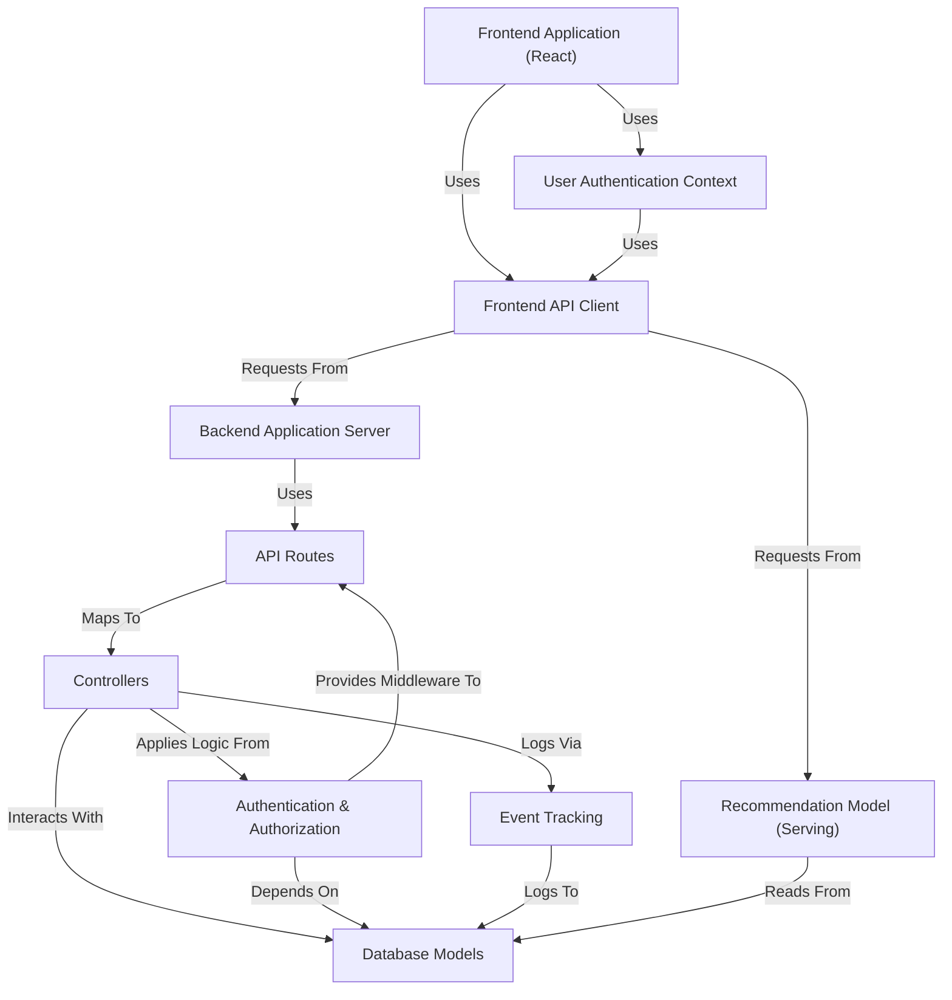

# Tutorial: Recommender-Algorithm

This project is an **e-commerce platform** with a focus on **product recommendation**.
It consists of a **React frontend** for user interaction, an **Express.js backend**
to manage data and business logic, and a separate **Python Flask service**
for generating **personalized product recommendations** based on user events and
product data stored in a **MongoDB database**. It also handles **user authentication**
and tracks key **user interactions** for recommendations.

## Visual Overview

## Chapters

1. [Frontend Application (React)
](01_frontend_application__react__.md)
2. [Frontend API Client
](02_frontend_api_client_.md)
3. [User Authentication Context
](03_user_authentication_context_.md)
4. [API Routes
](04_api_routes_.md)
5. [Backend Application Server
](05_backend_application_server_.md)
6. [Database Models
](06_database_models_.md)
7. [Authentication & Authorization
](07_authentication___authorization_.md)
8. [Controllers
](08_controllers_.md)
9. [Event Tracking
](09_event_tracking_.md)
10. [Recommendation Model (Serving)
](10_recommendation_model__serving__.md)
